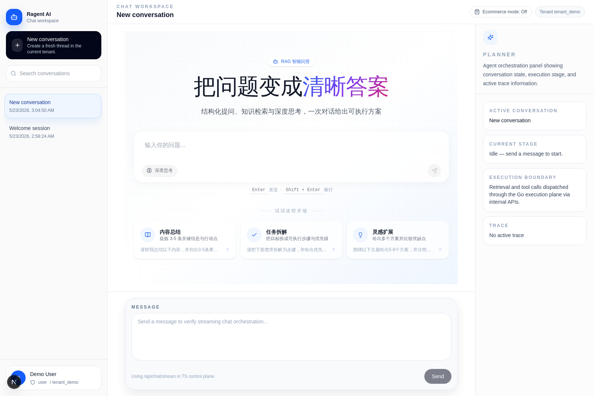
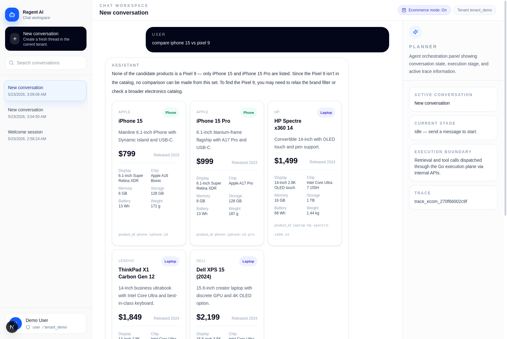

# Ragent-Py

`Ragent-Py` is a **modular Agent platform skeleton**. The Python runtime is
the active execution plane *and* the canonical home for business and
platform modules; the Next.js app under `web/` is the UI / BFF control
plane that sits in front of it.

The skeleton is structured so that each cross-cutting capability
(tools, retrieval sources, ingestion adapters, renderer blocks, intent
patterns, eval suites) is owned by a dedicated sub-registry, and each
business or platform feature ships as a **module** that contributes to
those sub-registries through one `register()` call. The four-layer
split below is enforced in code, not just by convention.

## Architecture

```
src/ragent_python/
├── core/              # orchestration kernel — Module / GenerationAdapter / IntentPattern / streaming contracts
├── infra/             # adapters and registries — registries/, llm/, ingestion/, eval/
├── modules/           # business and platform modules — platform_admin/, demo_corpus/, …
└── ui_contracts/      # renderer block schemas exposed to the BFF
```

### `core/`

The orchestration kernel. Defines what a module *is* (`core/modules`),
the streaming contracts (`core/stream`), the intent-routing primitives
(`core/router`), and the LLM generation interface every module talks to
(`core/generation`). Has **no dependency on `infra/` or `modules/`** —
this is the layer that survives provider / module churn.

### `infra/`

Adapters and registries. The six sub-registries that fan a module's
`register()` output out into globally discoverable artifacts live here
(`infra/registries/`), alongside concrete LLM provider plumbing
(`infra/llm/`), ingestion schema adapters (`infra/ingestion/`), and the
eval registry (`infra/eval/`). `infra/` knows about `core/`'s contracts;
modules import `infra/` registry types but **not** each other.

### `modules/`

Business and platform modules. Each module lives in `modules/<name>/`
and exposes a class satisfying `core.modules.Module`. Its `register()`
returns a `ModuleHookResult` describing what it contributes:

| field                | sub-registry it lands in              |
| -------------------- | ------------------------------------- |
| `tool_pack`          | `ToolPackRegistry`                    |
| `retrieval_sources`  | `RetrievalSourceRegistry`             |
| `ingestion_adapters` | `IngestionSchemaAdapterRegistry`      |
| `renderer_blocks`    | `RendererBlockRegistry`               |
| `intent_patterns`    | `IntentPatternRegistry`               |
| `evals`              | `EvalSuiteRegistry`                   |

Modules **never** import each other; cross-module wiring happens only
through the sub-registries.

### `ui_contracts/`

Pydantic schemas for renderer blocks (product cards, spec-compare
tables, etc.) that the BFF and the React UI consume. This is the single
source of truth for typed UI block payloads; the TS side re-derives its
types from these schemas.

## Bootstrap

`modules.bootstrap_default_modules()` is the single registration
entrypoint. It is idempotent, safe to call across a `clear()` cycle, and
shared by both eager startup (`main.create_app()`) and the legacy MCP
facade's lazy first call.

```python
from ragent_python.modules import bootstrap_default_modules

bootstrap_default_modules()
# registers PlatformAdminModule + DemoCorpusModule against the
# default global registry, then fans their contributions out to the
# six sub-registries above.
```

## Landed Modules

### `modules/platform_admin/`

Platform-level introspection. Owns three tools that previously lived
inline in `mcp/registry.py`:

| tool                  | requires_admin |
| --------------------- | -------------- |
| `list_knowledge_bases` | no             |
| `get_system_setting`  | yes            |
| `get_ingestion_task`  | yes            |

The module contributes a single `ToolPack(name="platform_admin")` to
`ToolPackRegistry`. `mcp/registry.py` is now a thin proxy onto that
registry, so every existing caller (`services/mcp_service`, the
`/internal/mcp/execute` endpoint, the legacy `list_mcp_tools()` /
`get_mcp_tool()` helpers) keeps working unchanged.

### `modules/demo_corpus/`

The six-chunk hand-curated demo dataset (policy / ops / product). Owns:

- `LOCAL_KNOWLEDGE` — the six chunks
- `LocalStaticRetrievalProvider` — the keyword-overlap scorer over them
- one `RetrievalSourceSpec(name="demo_corpus")` published to
  `RetrievalSourceRegistry` via `bootstrap_default_modules()`

The spec's selector activates when the request has no
`knowledgeBaseIds` filter *or* when the request targets at least one of
`kb_policy` / `kb_ops` / `kb_product`. `retrieval/corpus.py` and
`retrieval/providers.py` re-export the moved symbols, so the legacy
hybrid path (`build_default_retrieval_provider` → BM25 + ingestion +
local-static fallback) still works with zero call-site changes.

### `modules/ecommerce/`

First end-to-end business module: an 18-SKU 3C catalog (laptops, phones,
tablets, earbuds, monitors) with structured filters, two renderer
blocks, and a module-scoped chat lane. Contributes to three
sub-registries through `register()`:

| sub-registry              | contribution                                              |
| ------------------------- | --------------------------------------------------------- |
| `RetrievalSourceRegistry` | `ProductCatalogRetrievalProvider` (keyword + filter scorer) |
| `RendererBlockRegistry`   | `ProductCardBlock`, `SpecCompareBlock`                    |
| `IntentPatternRegistry`   | 3 keyword patterns: `product_consult` / `product_compare` / `product_buy` (see [Main chat: Ecommerce mode](#main-chat-ecommerce-mode-router) below) |

A dedicated preview surface lives at `web/app/preview/ecommerce/` and
uses four BFF-fronted endpoints that bypass `services/chat_service`
and the main `/api/chat` pipeline by design:

| python endpoint                          | what it does                                                              |
| ---------------------------------------- | ------------------------------------------------------------------------- |
| `POST /internal/ecommerce/search`        | catalog filter + `ProductCardBlock[]`                                     |
| `POST /internal/ecommerce/compare`       | `SpecCompareBlock` side-by-side table for 2–4 selected product ids        |
| `POST /internal/ecommerce/chat`          | retrieval → `GenerationAdapter.generate()` → one-shot `{answer, blocks}`  |
| `POST /internal/ecommerce/chat/stream`   | retrieval → `GenerationAdapter.stream()` → NDJSON `retrieval/delta/done`  |

The streaming wire format is one JSON object per newline. The first
event carries the retrieved product ids + their `ProductCardBlock`s so
the UI can paint the grid before the model starts emitting tokens:

```ndjson
{"type":"retrieval","query":"...","retrieved_product_ids":[...],"blocks":[{"type":"product_card",...}, ...]}
{"type":"delta","text":"The best fit is"}
{"type":"delta","text":" the Lenovo Legion Slim 5"}
{"type":"delta","text":" ..."}
{"type":"done","provider":"openai_compatible","model":"qwen-plus","finish_reason":"stop","input_tokens":null,"output_tokens":null}
```

#### Preview screenshots

`Search` runs `/internal/ecommerce/search`. Empty query lists every
fixture row; `Category` + `Price band` apply structured filters on the
Python side.


`Compare` ticks 2–4 cards then calls `/internal/ecommerce/compare`,
which resolves the product ids on the Python side and returns a
`SpecCompareBlock` with a stable row order (Price / Display / Chip /
Memory / Storage / Battery / Weight / Released).


`Ask (stream)` calls `/internal/ecommerce/chat/stream`. The retrieved
product cards land first (off the leading retrieval event), then the
LLM answer streams in delta-by-delta, then provider / model /
finish_reason badges freeze on the final done event. The shot below
is the OpenAI-compatible adapter pointed at DashScope `qwen-plus`:


#### Main chat: Ecommerce mode (router)

After the preview surface stabilized, the ecommerce module's chat
lane was lifted into the main chat UI behind a single explicit
toggle, **without touching `services/chat_service`, the existing
`/internal/chat/stream` endpoint, the main `/api/chat/stream` BFF
route, or the main stream protocol on the wire**. The integration
is a thin controlled router plus a protocol translator; the
classifier is keyword-only by design.

**Entry point: a per-conversation toggle in the chat header.** Off
by default — the main chat behaves exactly as before. Flipping it
on re-points the BFF at the router endpoint instead of the default
chat endpoint for subsequent messages.

| toggle state                  | BFF upstream                          | classifier runs? | main path touched? |
| ----------------------------- | ------------------------------------- | ---------------- | ------------------- |
| **Off** (default)             | `POST /internal/chat/stream`          | no               | no                  |
| **On**, ecommerce intent hit  | `POST /internal/chat/router/stream` → ecommerce bridge | yes              | no                  |
| **On**, no ecommerce intent   | `POST /internal/chat/router/stream` → falls back to `chat_service` | yes              | no — same protocol  |



**Intent classification: zero-LLM, keyword-only.**
`core/router/intent_router.py` matches the user query against the
`IntentPatternRegistry`, filtered to the active module. Each
pattern declares a keyword set + a weight; the highest-weight match
wins. There is no embedding call, no LLM call, no per-conversation
state — the classifier is a pure function of the query string.

The ecommerce module contributes three patterns
([`modules/ecommerce/intent.py`](src/ragent_python/modules/ecommerce/intent.py)):

| intent                          | weight | sample keywords (EN + CN)                                                                 | what it means                                                |
| ------------------------------- | ------ | ----------------------------------------------------------------------------------------- | ------------------------------------------------------------ |
| `ecommerce.product_consult`     | 1.0    | `laptop`, `phone`, `tablet`, `monitor`, `earbuds`, `macbook`, `recommend`, `best `, `推荐`, `买什么` | catalog browse / recommendation                              |
| `ecommerce.product_compare`     | 2.0    | `compare `, `vs `, ` vs.`, `versus`, `difference between`, `which is better`, `对比`        | explicit comparison                                          |
| `ecommerce.product_buy`         | 3.0    | `buy`, `purchase`, `order `, `checkout`, `add to cart`, `looking to buy`, `ready to buy`  | purchase intent (highest weight — verbs are rarely ambiguous) |

When a query hits multiple patterns the highest weight wins, so e.g.
`compare iphone 15 vs pixel 9` resolves to `product_compare`, not
`product_consult`. The inspection endpoint exposes the raw decision:

```bash
$ curl -s -X POST -H 'Content-Type: application/json' \
    -d '{"userId":"u1","tenantId":"t1","message":"compare iphone 15 vs pixel 9","mode":"ecommerce"}' \
    http://127.0.0.1:8000/internal/chat/router/decision
{"mode":"ecommerce","routed_to":"ecommerce","intent":"ecommerce.product_compare","matched_intents":["ecommerce.product_compare","ecommerce.product_consult"]}

$ # … and 'buy' wins over both:
$ curl -s … -d '{… "message":"I want to buy a tablet for my mom" …}' http://…/decision
{"mode":"ecommerce","routed_to":"ecommerce","intent":"ecommerce.product_buy","matched_intents":["ecommerce.product_buy","ecommerce.product_consult"]}

$ # … and an unrelated query falls back to the default lane:
$ curl -s … -d '{… "message":"what is the capital of france" …}' http://…/decision
{"mode":"ecommerce","routed_to":"default","intent":null,"matched_intents":[]}
```

**Protocol: translated into the existing main stream protocol — no
new protocol on the wire.** The router endpoint never invents new
event types. When ecommerce wins, the bridge
([`modules/ecommerce/chat_stream_bridge.py`](src/ragent_python/modules/ecommerce/chat_stream_bridge.py))
consumes the ecommerce-internal NDJSON
(`retrieval` → `delta` × N → `done`, same as the preview lane) and
re-emits it as the exact event sequence that the main chat UI's
stream parser already handles:

| ecommerce-internal event       | re-emitted main-protocol event(s)                                                                                 |
| ------------------------------ | ------------------------------------------------------------------------------------------------------------------ |
| (router decision before stream)| `chat.started` (carries the user message + a fresh `traceId`)                                                      |
| `retrieval`                    | `thinking.delta` × 2 (`"Searching the ecommerce catalog…"` + `"matched N product(s): …"`) → `thinking.completed`   |
| `delta` × N                    | `message.delta` × N (verbatim token forwarding)                                                                    |
| `done`                         | `message.completed` (carrying the accumulated answer + `metadata.blocks: ProductCardBlock[]` + `metadata.router.intent`) → `chat.completed` (with `plan.retrievalReason = "<intent> (router)"`) |

The classified intent flows through `metadata.router.intent` and
`plan.retrievalReason` verbatim, so downstream trace / analytics can
differentiate `consult` / `compare` / `buy` queries without re-running
the classifier.

**On the wire the main UI's stream parser sees the same shape it
sees for every other conversation** — `chat.started`, optional
`thinking.*`, `message.delta` × N, `message.completed`,
`chat.completed`. The only UI addition is a small `MessageBlocks`
component that reads `assistantMessage.metadata.blocks` and renders
the `product_card` / `spec_compare` blocks below the markdown answer.



The shot above is the toggle flipped on against a real LLM
(DashScope `qwen-plus` via the OpenAI-compatible adapter) with the
query `compare iphone 15 vs pixel 9`. Notice the trace panel:
`trace_ecom_…` (router-issued trace id), the inline product card
grid (ecommerce module's `ProductCardBlock`), and that the assistant
text is plain markdown streamed via standard `message.delta` events —
the UI parser was not modified.

**Hard constraints honored.** Verifiable with `git diff main` on
these files / paths:

- `src/ragent_python/services/chat_service.py` — **0 lines changed**
- `src/ragent_python/api/internal_chat.py` (`/internal/chat/stream`) — **0 lines changed**
- main stream wire protocol (`contracts/public_api.py`'s `ChatStreamEvent` union) — **0 new event types**
- `web/app/api/chat/stream/route.ts` default branch — unchanged; the only addition is a single `if (ecommerceMode)` switch that picks the upstream URL
- toggle Off → the upstream URL, payload, and stream-parsing branch are byte-for-byte identical to pre-router `main`

All of this is exercised end-to-end by `tests/test_chat_router.py`
(22 tests covering classifier behavior, EN+CN keywords, bridge
protocol translation, intent passthrough into
`metadata.router.intent` + `plan.retrievalReason`, and the
`/internal/chat/router/{decision,stream}` endpoints).

## What the runtime already supports

- streaming chat over `/api/chat/stream`
- non-stream chat over `/api/chat`
- ingestion task creation, tracking, and worker execution
- Qdrant-backed dense retrieval
- BM25 keyword retrieval
- hybrid fusion and reranking
- MCP/tool runtime integration
- trace stage persistence through the BFF
- admin ingestion flows
- verify/e2e scripts for major runtime paths

## Repository Layout

```text
Ragent-Py/
├── .github/workflows/   # CI workflows (pytest)
├── web/                 # Next.js frontend, BFF, admin shell
├── src/ragent_python/
│   ├── core/            # orchestration kernel
│   ├── infra/           # adapters + registries
│   ├── modules/         # platform & business modules
│   ├── ui_contracts/    # renderer block schemas
│   ├── api/             # FastAPI routers
│   ├── services/        # service-layer entry points
│   ├── retrieval/       # retrieval pipeline (hybrid / BM25 / Qdrant / rerank)
│   ├── mcp/             # thin facade over ToolPackRegistry
│   ├── contracts/       # internal & public API pydantic models
│   ├── storage/         # ingestion repository
│   └── worker/          # ingestion worker
├── tests/               # pytest suite
├── scripts/             # verification helpers
└── pyproject.toml
```

## Quick Start

### 1. Python backend

```bash
pip install -e ".[dev]"
PYTHONPATH=src uvicorn ragent_python.main:app --host 0.0.0.0 --port 8000
```

`pip install -e ".[dev]"` only pulls `pytest`. LLM provider SDKs are
opt-in extras (`llm-openai`, `llm-anthropic`, `llm-ollama`) and stay
unimported until a provider is wired in.

### 2. Frontend / BFF

```bash
cd web
npm install
npm run dev
```

### 3. Local wiring

```bash
RAG_BACKEND=python
PYTHON_API_BASE_URL=http://127.0.0.1:8000
```

With that setup `web/` handles browser-facing routes and Python handles
the execution behind them.

## Python Runtime Endpoints

Core runtime (main pipeline):

- `GET /healthz` — also reports the current `generation_provider`
- `POST /internal/chat/turn`
- `POST /internal/chat/stream`
- `POST /internal/retrieval/search`
- `POST /internal/mcp/execute`
- `GET /internal/ingestion/tasks`
- `POST /internal/ingestion/tasks`
- `GET /internal/ingestion/tasks/{taskId}`
- `POST /internal/ingestion/worker/run`

Module preview lanes (bypass `services/chat_service` by design — used
by `web/app/preview/*` only):

- `POST /internal/ecommerce/search`
- `POST /internal/ecommerce/compare`
- `POST /internal/ecommerce/chat`
- `POST /internal/ecommerce/chat/stream` (NDJSON `retrieval` / `delta` / `done` events)

Main chat router (controlled entry into the ecommerce module from
the main chat UI — only reachable when the user flips the in-header
**Ecommerce mode** toggle on; default-off path keeps every byte
identical to `/internal/chat/stream`):

- `POST /internal/chat/router/decision` — inspect-only; returns the keyword classifier's `RoutingDecision(intent, module, matched_intents)` without running any LLM
- `POST /internal/chat/router/stream` — dispatches: matched ecommerce intent → bridge translates the ecommerce NDJSON into the **existing main chat stream protocol** (`chat.started` → `thinking.*` → `message.delta` × N → `message.completed` → `chat.completed`), otherwise transparently forwards to the default chat service lane

## Ingestion Worker

The ingestion task store supports:

- `PYTHON_INGESTION_BACKEND=sqlite`
- `PYTHON_INGESTION_BACKEND=memory`

Run one worker cycle:

```bash
python -m ragent_python.worker_runner --once
```

Run one worker cycle for a specific task:

```bash
python -m ragent_python.worker_runner --once --task-id ing_123
```

Run a polling worker loop:

```bash
python -m ragent_python.worker_runner
```

## Retrieval and Reranking

Pipeline currently supported:

- Qdrant dense retrieval
- local BM25 keyword retrieval
- reciprocal-rank fusion
- external or heuristic reranking
- module-owned retrieval sources via `RetrievalSourceRegistry`
  (today: `demo_corpus`)

Environment variables:

- `PYTHON_RETRIEVAL_BACKEND`
- `PYTHON_QDRANT_URL`
- `PYTHON_QDRANT_API_KEY`
- `PYTHON_QDRANT_COLLECTION`
- `PYTHON_QDRANT_TIMEOUT_MS`
- `PYTHON_QDRANT_VECTOR_SIZE`
- `PYTHON_RERANKER_BACKEND`
- `PYTHON_RERANKER_TIMEOUT_MS`
- `PYTHON_BGE_RERANKER_URL`
- `PYTHON_RERANK_CANDIDATE_COUNT`
- `PYTHON_RERANK_RETRIEVAL_WEIGHT`
- `PYTHON_RERANK_MODEL_WEIGHT`

Legacy compatibility:

- `BGE_RERANKER_URL` is also accepted

## LLM Generation

`core/generation/adapter.py` defines the `GenerationAdapter` Protocol
that every module must call through. A request carries an input-token
budget (default `16000`) and an output-token budget (default `2000`);
both are configurable via `PYTHON_LLM_MAX_INPUT_TOKENS` /
`PYTHON_LLM_MAX_OUTPUT_TOKENS`.

Provider resolution is chained — `PYTHON_LLM_FALLBACK_CHAIN` defaults to
`openai,anthropic,ollama,mock`. Modules **must not** import provider
SDKs directly; the resolver wires the first reachable provider behind
the adapter.

### OpenAI-compatible adapter

`OpenAICompatibleGenerationAdapter` is the single adapter implementation
used for every OpenAI-compatible provider (OpenAI proper, DashScope,
Moonshot, DeepSeek, SiliconFlow, self-hosted vLLM / SGLang, …). The
adapter does not know the provider's name — it is selected entirely
through environment variables:

| variable                   | purpose                                                  |
| -------------------------- | -------------------------------------------------------- |
| `OPENAI_API_KEY`           | required for any hosted provider (omit for self-hosted)  |
| `OPENAI_BASE_URL`          | provider-specific endpoint base URL                       |
| `PYTHON_LLM_MODEL`         | model name to send on every request                       |
| `PYTHON_LLM_FALLBACK_CHAIN`| resolver chain (`openai` activates the adapter)           |

Example matrices:

| provider          | `OPENAI_BASE_URL`                                          | `PYTHON_LLM_MODEL`      |
| ----------------- | ---------------------------------------------------------- | ----------------------- |
| OpenAI proper     | (unset — SDK default)                                      | `gpt-4o-mini`           |
| DashScope (Qwen)  | `https://dashscope.aliyuncs.com/compatible-mode/v1`        | `qwen-plus`             |
| Self-hosted vLLM  | `http://vllm-host:8000/v1`                                 | `Qwen/Qwen2.5-7B-Instruct` |

Adapter behavior is identical across providers:

- `generate()` returns a one-shot `GenerationResult` with mapped finish
  reason (`length`, `tool_calls` → `tool_call`, `content_filter`).
- `stream()` opens the provider's native streaming endpoint
  (`stream=True`) and yields `GenerationChunk(delta=..., finish_reason=None)`
  per token batch, followed by a final empty chunk with the mapped finish
  reason. `APITimeoutError` / `APIError` collapse to a single chunk
  with `finish_reason="error"` so the module-side orchestrator can still
  close a streaming response cleanly. `MockGenerationAdapter` mimics the
  same shape (word-by-word deltas) so the preview UI keeps streaming
  visibly even with no API key configured.

`.env.example` lists ready-to-paste config blocks for several common
providers.

## Continuous Integration

Two workflows gate `main`:

- `.github/workflows/pytest.yml` — `pytest tests/ -q` on every push to
  `main` and every PR targeting `main`.
- `.github/workflows/web-build.yml` — `npm ci` + `npm run typecheck` +
  `npm run build` against `web/` on the same triggers.

Lint and matrix builds are intentionally out of scope for now.

## Verification

### Python tests

```bash
pytest
```

```bash
python -m compileall src scripts
```

### Python verification scripts

```bash
python scripts/verify_qdrant_e2e.py
python scripts/verify_chat_stream_metadata_e2e.py
python scripts/verify_chat_trace_e2e.py
```

### Frontend / BFF verification

Inside `web/`:

```bash
npm run typecheck
npm run verify:rag-e2e
npm run verify:mcp-runtime-e2e
npm run verify:auth-scope-e2e
```
